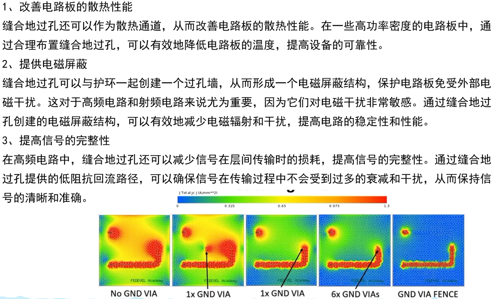
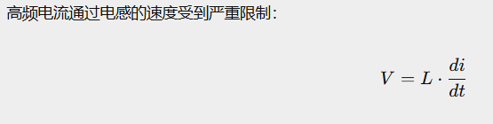
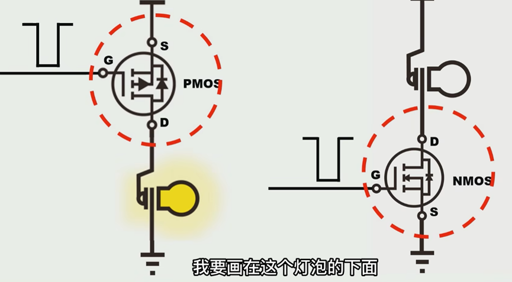
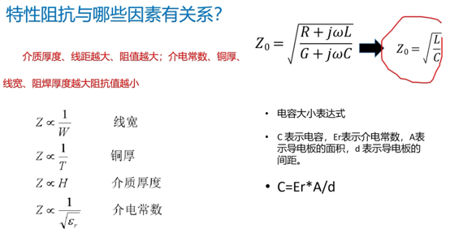
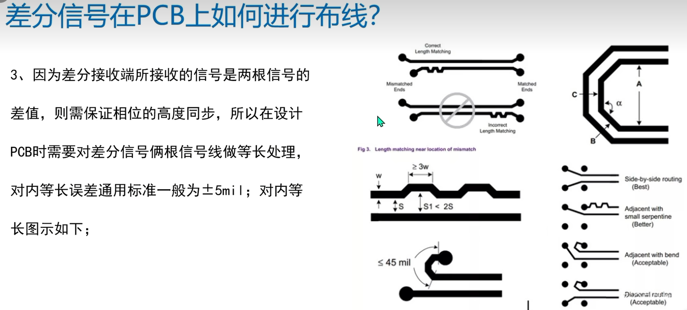

# PCB Engine 笔记

## 目录

- [一、基础概念与电路符号](#一基础概念与电路符号)
- [二、器件参数与规格识别](#二器件参数与规格识别)
- [三、PCB封装与硬件接口](#三pcb封装与硬件接口)
- [四、高速信号相关](#四高速信号相关)
- [五、采购与安装备忘](#五采购与安装备忘)

---

## 一、基础概念与电路符号

| 领域                     | 核心技术             | 解决的问题             | 关键规则/指标                                     |
| ------------------------ | -------------------- | ---------------------- | ------------------------------------------------- |
| **信号完整性 SI**  | 阻抗控制             | 信号反射、波形失真     | 单端 50Ω / 差分 100Ω，线宽由叠层决定            |
| **信号完整性 SI**  | 等长匹配             | 差分/并行信号时序错位  | 差分对内 <5mil；DDR 按组匹配                      |
| **信号完整性 SI**  | 阻抗匹配（端接电阻） | 消除信号反射振铃       | 源端串联 22~33Ω / 终端并联 50Ω                  |
| **信号完整性 SI**  | 回流路径管理         | 信号辐射、阻抗突变     | 信号层下必须有完整 GND，**严禁跨分割**      |
| **信号完整性 SI**  | 串扰控制             | 相邻走线互相干扰       | 线间距 ≥ 3W；时钟线两侧包地                      |
| **电源完整性 PI**  | 去耦电容布局         | 芯片瞬态电流供应不足   | 紧贴管脚，容值梯级（100nF → 10nF → 1nF）        |
| **电源完整性 PI**  | DC 压降（IR Drop）   | 电源线过细导致压降过大 | 1mm 铜皮约通 1~2A，大电流需加宽加厚               |
| **电源完整性 PI**  | PDN 阻抗优化         | 电源噪声、电压跌落     | 电源/地层紧耦合，间距 < 4mil                      |
| **电磁兼容 EMC**   | 叠层结构设计         | 辐射超标、层间干扰     | 每个信号层必须紧邻参考平面                        |
| **电磁兼容 EMC**   | 分区隔离（Zoning）   | 高速数字干扰模拟/RF    | 各功能模块物理隔离 ≥ 196.9~393.7mil（5~10mm）   |
| **电磁兼容 EMC**   | 板边缝合孔           | 电磁从板边泄露辐射     | 板边一圈密集 GND 过孔，间距 < λ/20               |
| **电磁兼容 EMC**   | 20H 原则             | 电源平面边缘辐射       | 电源层边缘比 GND 层内缩 20×介质厚度              |
| **叠层/过孔**      | 叠层设计             | 阻抗参考、回流路径     | 4层：TOP/GND/PWR/BOT；6层内层走高速线             |
| **叠层/过孔**      | 过孔换层回流孔       | 换层处阻抗不连续       | 换层过孔旁就近打 GND 回流过孔                     |
| **叠层/过孔**      | 背钻（Back-drill）   | 过孔残桩引发谐振       | 25Gbps+ 高速 SERDES 必须背钻                      |
| **叠层/过孔**      | 散热过孔阵列         | 大功率器件散热不足     | 芯片底部矩阵打过孔，铜填充导热                    |
| **布局布线**       | 模块化分区布局       | 模块间互相干扰         | 电源/数字/模拟/高速接口各自独立分区               |
| **布局布线**       | 禁止 90° 直角       | 走线拐角阻抗突变       | 一律改用 45° 斜角或圆弧                          |
| **布局布线**       | 高速信号走内层       | 辐射和串扰偏大         | 带状线（Stripline）天然屏蔽效果好                 |
| **高密度封装 HDI** | BGA 扇出（Fanout）   | 密脚芯片无法引出走线   | 狗骨头方式或 Via-in-Pad + 盲埋孔                  |
| **高密度封装 HDI** | DDR 拓扑设计         | 内存时序不满足要求     | DDR3 菊花链（Fly-by）；DDR4/5 更严格              |
| **高密度封装 HDI** | SERDES 通道仿真      | 高速链路插损/误码      | 必须做 3D 电磁仿真，不能只凭规则                  |
| **可制造性 DFM**   | 工艺极限管控         | 工厂造不出或良率低     | 最小线宽 3~4mil，最小孔径 7.9mil（0.2mm），加泪滴 |
| **可制造性 DFM**   | 测试点预留（DFT）    | 量产调试无法测试       | 关键网络预留 Test Point，方便 ICT 测试            |
| **热设计 Thermal** | 铜皮散热设计         | 功率器件过热损坏       | 大面积铜皮 + 散热过孔 + 靠近板边布局              |
| **热设计 Thermal** | 铜量均匀分布         | PCB 焊接翘曲变形       | 各层铜箔覆盖率尽量均衡对称                        |

### 设计总原则

**信号部分追求 “稳定传输、少干扰”，功率部分追求 “载流够、散热好、回路小、不串扰”** 。

- VDD，VCC是电源
- vss是地
- 1 mil = 0.0254 mm
- 1 mm ≈ 39.3701 mil
- EP引脚说明：Exposed Pad：通常接地
- 电容ESR等效串联电阻，直接影响纹波电压，功耗，瞬态响应。想低ESR用MLCC或者并联。注意！某些LDO需要特定ESR工作
- 大电流线：尽量少打孔，多颗并联。
- 小信号线：为了路径更短、位置更干净，合理使用过孔，没问题。
- 不完整的参考平面、绕远的信号回路、跨分割走线，是干扰的主要来源。

### 过孔对信号的主要影响

过孔对信号的负面影响，本质来自两个寄生参数和一个平面破坏，只有高速信号才会显著体现。

**1. 阻抗不连续：信号反射的来源**

同层走线只要参考平面完整、线宽固定，阻抗就是连续稳定的；但过孔本身是一个垂直的金属圆柱，自带寄生电容和寄生电感，会让阻抗在过孔位置突然下跌 / 凸起，形成阻抗突变。

- 寄生电容：过孔焊盘与周围参考平面之间形成电容效应，会让局部阻抗降低；
- 寄生电感：垂直过孔柱体等效为小电感，会让局部阻抗升高；
- 最大元凶：过孔残桩（Stub）：如果信号从第 1 层走到第 3 层，过孔在第 4~6 层多余的 "尾巴" 就是残桩，它会引发严重的信号反射和谐振，是高速信号（DDR3/4、千兆网、USB3.0）的头号杀手。通过背钻工艺将多余的孔铜钻掉来解决这种影响

对于低速信号（比如 GPIO、UART、SPI，几十 MHz 以内），过孔带来的阻抗变化完全在信号容忍范围内，不会产生任何可观测的问题；只有信号上升沿小于 1ns、频率上百 MHz 以上，才需要专门优化过孔阻抗。

**2. 参考平面破坏：串扰与 EMI 的来源**

过孔需要穿过所有层的参考平面（地平面 / 电源平面），平面上会挖出一圈反焊盘（避让铜皮）。

单个过孔的影响很小，但过孔密集扎堆时，参考平面会被挖得千疮百孔，信号回流路径被迫绕路，回路面积变大，既会增加串扰，也会提升电磁辐射（EMI）。

信号换层时如果旁边没有就近的地过孔提供回流路径，回流会绕很远的路，这才是过孔引发干扰的主要原因，而非过孔本身。

**缝合地过孔的重要性：**

缝合地过孔正是解决这一问题的关键——通过在平面间布置接地过孔，为信号回流提供就近路径，减小回路面积、抑制串扰与 EMI。

### 布线与电流

- 在1oz铜厚下跑1A电流推荐20~30mil（0.5mm）左右，2A-3A则是31.5-47.2mil（0.8-1.2mm），若是更高优先铺铜并选更厚的铺铜
- 大电流回流路径注意铺铜采用直连，比如EP，降压/电机芯片GND脚，和它对应的滤波电容

### 滤波电容

- 滤波电容小容值要最靠近芯片引脚滤除高频，eg：100nf放的离芯片最近
- 滤波电容的对交流信号的阻抗计算公式：$Z_C = \frac{1}{2\pi f C}$

### 去耦电容的工作原理

MCU 在高速运行时，内部逻辑门频繁翻转，会产生瞬态的大电流需求（可能在 **几百 ps 内**就需要几十 mA）。

远处的电源来不及响应，所以需要在芯片旁边放一个" **本地电荷水库** "——即去耦电容。它的任务是：

> **在电源来不及反应的瞬间，立刻补充电流给芯片**
>
> 

### 三极管与Mos管基础

- 三极管（BJT）➡mos管。由电流控制电流到电压控制电流（几乎不消耗电流）

**Mos管基础**

G（栅极）D（漏极）S（源极）

- Vgs（th）mos管打开电压------GS端电压高于阈值电压mos'管打开
- CGS：栅极和源极之间的寄生电容

| 特性         | PMOS 管 (P 沟道 MOS 管)                     | NMOS 管 (N 沟道 MOS 管)                      |
| ------------ | ------------------------------------------- | -------------------------------------------- |
| 沟道类型     | 由空穴形成 P 型导电沟道                     | 由自由电子形成 N 型导电沟道                  |
| 导通条件     | G 极电压 <S 极电压，且低于阈值 (Vth) 时导通 | G 极电压 > S 极电压，且超过阈值 (Vth) 时导通 |
| 电流方向     | 电流从源极 S 流向漏极 D                     | 电流从漏极 D 流向源极 S                      |
| 开关类比     | 低电平接通的开关                            | 高电平接通的开关                             |
| 典型应用电路 | 高端开关（负载在 D 极，S 极接电源）         | 低端开关（负载在 D 极，S 极接地）            |
| 性能特点     | 导通电阻通常稍大，成本略高                  | 导通电阻小，成本低，开关速度快（技术更成熟） |
| 电路符号箭头 | 箭头背离栅极                                | 箭头指向栅极                                 |

### 一阶无源RC低通滤波器

一阶无源RC型低通滤波器对高频信号的滤除：$f_c = \frac{1}{2\pi RC}$

参数说明：

- ：$f_c$截止频率，单位为赫兹（Hz）
- $R$：串联在通路中的电阻阻值，单位为欧姆（Ω）
- $C$：并联在输出端对地的电容容值，单位为法拉（F）

---

## 二、器件参数与规格识别

### 电容标识与单位换算

- 电容上的 "104""106" 是数码表示法（常用于贴片电容），规则为：前两位是有效数字，第三位是 "10 的幂次"，单位是 皮法（pF）。
- 104" 对应 0.1μF，"106" 对应 10μF

单位换算：

- 1uF=1000nF
- 1nF=1000pF

### 极性识别

- 二极管（肖特基二极管）：有标记的是负极，无标记的是正极
- led长脚正极，短脚负极
- 铝电解电容有阴影标识为负，引脚长正——短负。
- 固态铝电解电容带角度∠的一头是正极，平头是负极。上面黑色面是负极
- 钽电解电容有标识一端是正极！！和其他相反。相对于⬆优势有ESR小，耐温好

### 常见器件术语

以下是电路中常遇到的器件缩写与全称：

- BDC——有刷直流电机（brushed DC Motor）
- HF External XTAL" 指的是高频外部晶体振荡器，即外部高速晶振

### 特殊器件

- 0欧姆电阻——并非0欧姆（50mR左右）。作用：在高频信号下充当电感电容解决emc问题，或者用作功率地和信号地之间的单点接地

---

## 三、PCB封装与硬件接口

### 器件封装相关

- 常见的排针排母，记得用和买2.54mm（100mil）间隔的！！！！！！
- 间距Pitch：用数字表示针脚中心之间的距离（单位：毫米）
- 间距系列 + 具体间距值 + 针数 + [结构 / 排数]
- PH：间距 78.7mil（2.0mm）（最常见的小型排针，如蓝牙模块、传感器接口）
- 100mil（2.54mm）：无字母前缀时，直接用 "间距值 + P" 表示
- 不要完全贴近板边
- 器件丝印能看见的合适尺寸是 -》 线宽5.9mil（0.15mm），高51.2mil（1.3mm）

### PCB设计、制板与布局规范

- 嘉立创PCB器件自制封装注意：默认焊盘带钻孔，贴片需调成单层！！！
- 嘉立创打盲埋孔需要选特殊板材
- 晶振下方不能走信号线，元件，（不能铺铜（四层注意GND和PWR层）--存疑），不要靠近板边。！靠近mcu放置，
- 旁边记得每隔78.7mil（2mm）打一圈地孔屏蔽
- 数字地和模拟地之间保持20~40mil避免串扰
- 不同电压网络铺铜之间保持12mil间距
- 记得最后加上泪滴，铺铜。
- 不要完全贴近板边

---

## 四、高速信号相关

### 高速信号定义与特性阻抗

数字逻辑电路的频率触及或者超过45MHz到50MHz的范围，一般认为是高速电路。

严格来说：信号线的传播时延超过（数字信号驱动端）上升时间的一半即被视为高速信号且可能产生传输线效应。

PCB表面走的是微带线。PCB内层走的是带状线。

特性阻抗（即阻抗）是高速信号在传输线传播时，传输线每一点由电压和瞬时充电电流等效出来的阻抗，不是实体电阻，由传输线结构决定。

**通用公式（有损传输线全公式）**

$$
Z_0 = \sqrt{\frac{R + j\omega L}{G + j\omega C}}
$$

**简化公式（无损 / 理想传输线公式）**

$$
Z_0 = \sqrt{\frac{L}{C}}
$$

| 符号       | 参数名称         | 单位      | 物理含义                                                |
| ---------- | ---------------- | --------- | ------------------------------------------------------- |
| $Z_0$    | 特性阻抗         | 欧姆 (Ω) | 高频信号沿传输线传播时，线上传输的电压与电流的比值。    |
| $R$      | 单位长度寄生电阻 | Ω/m      | 导线本身的导体电阻（会导致导线发热、信号衰减 / 铜损）。 |
| $L$      | 单位长度寄生电感 | H/m       | 信号线周围磁场储存能量的能力（自感）。                  |
| $G$      | 单位长度寄生电导 | S/m       | 信号线与参考平面之间介质材料的漏电导（介质损耗）。      |
| $C$      | 单位长度寄生电容 | F/m       | 信号线与参考平面之间电场储存能量的能力（充放电作用）。  |
| $\omega$ | 角频率           | rad/s     | $\omega = 2\pi f$，其中 $f$ 为信号交流频率。        |
| $j$      | 虚数单位         | -         | 表示复数平面中的虚数分量（相位差$90^\circ$）。        |

| 接口                         | 差分阻抗        | 单端阻抗       |
| ---------------------------- | --------------- | -------------- |
| **USB 2.0**            | **90Ω**  | 45Ω           |
| **USB 3.0/3.1**        | **90Ω**  | 45Ω           |
| **HDMI**               | **100Ω** | 50Ω           |
| **DisplayPort**        | **100Ω** | 50Ω           |
| **PCIe**               | **85Ω**  | 50Ω           |
| **DDR3/4 差分时钟 CK** | **100Ω** | 50Ω           |
| **DDR3/4 单端数据 DQ** | ——            | **50Ω** |
| **LVDS**               | **100Ω** | 50Ω           |
| **以太网**             | **100Ω** | 50Ω           |
| **射频 RF**            | ——            | **50Ω** |

### 低速数字信号：无需阻抗控制

**低速数字信号，不主动去贴着大功率走、绕超大环路、线宽细到工艺极限，正常布线怎么方便怎么来，都不会出问题。40MHz以下的单端数字信号完全不需要阻抗计算和阻抗控制。**

满足以下四条，均可按常规布线处理，无需阻抗计算与阻抗控制：

- **在过孔数量、换层次数** 方面：一条线换 2~3 层、多打几个过孔，对通信没有可观测的影响，不会因为多打了一个过孔就 I2C 通信失败、SPI 丢数据。
- **走线形状、拐角** 方面：走直角、走钝角、绕个弯、线宽忽宽忽窄，都不影响低速信号的正常传输，不用为了 “走直线” 强行破坏地平面。
- **走线长短（板内范围）方面** ：同一板子上，信号线长 2cm 还是 20cm，对几十 MHz 以内的信号来说，延迟差异可以忽略，完全不用刻意走最短。
- **线距方面** ：普通数字信号按板厂最小间距（6mil）走就行，不用特意拉开，串扰影响微乎其微。即使是RS485、CAN 这类低速差分信号，只要速率在 1Mbps 以内、板内走线，也不用精确算差分阻抗，保持两条线同层、大致等长、间距一致就足够。

### 阻抗匹配和绕等长分别用来干什么？

| 维度     | 特性阻抗 ($Z_0$)                 | 走线等长 (Length Matching)     |
| -------- | ---------------------------------- | ------------------------------ |
| 关注核心 | 走线的横截面结构（线宽、介质厚度） | 走线的纵向长度（物理传播距离） |
| 解决问题 | 解决信号反射、幅度失真问题         | 解决信号相位差、时序错位问题   |

以 SPI 总线为例：Spi通信协议线sclk和mosi以及miso尽量等长，使得时钟和数据信号传播延迟的相对一致（让 SCLK 与 MOSI/MISO 之间的时滞（skew）最小化，以保证接收端的建立/保持时间裕量）

绕等长规则：

### 高速六层板叠层顺序

| 序号 | 名称      |
| :--: | --------- |
|  1  | 顶层      |
|  2  | GND 02    |
|  3  | Signal 03 |
|  4  | Power 04  |
|  5  | GND 05    |
|  6  | 底层      |

（标准六层，信号质量最好）

---

## 五、采购与安装备忘

- 买元器件记得看数量！！！
- 铝电解电容有阴影标识为负，引脚长正——短负。（因与安装焊接时识别相关，此处重复列出）
- led长脚正极，短脚负极。（因与安装焊接时识别相关，此处重复列出）
- 铝电解电容买的时候不要买离工作电压太高的，工作电压 ≤ 额定电压 × 70%~80%
- 贴片电容MLCC应该充分考虑直流偏置效应的影响，买X7R材质的额定电压比较高的
